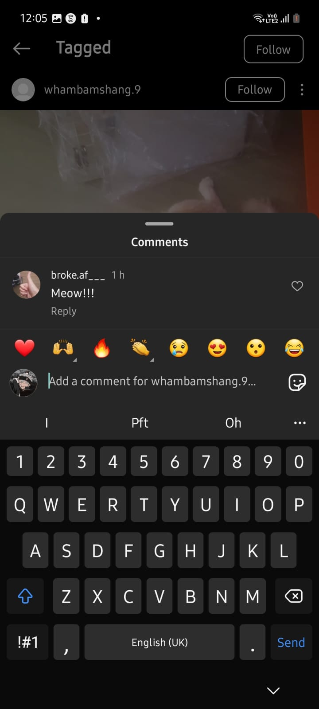
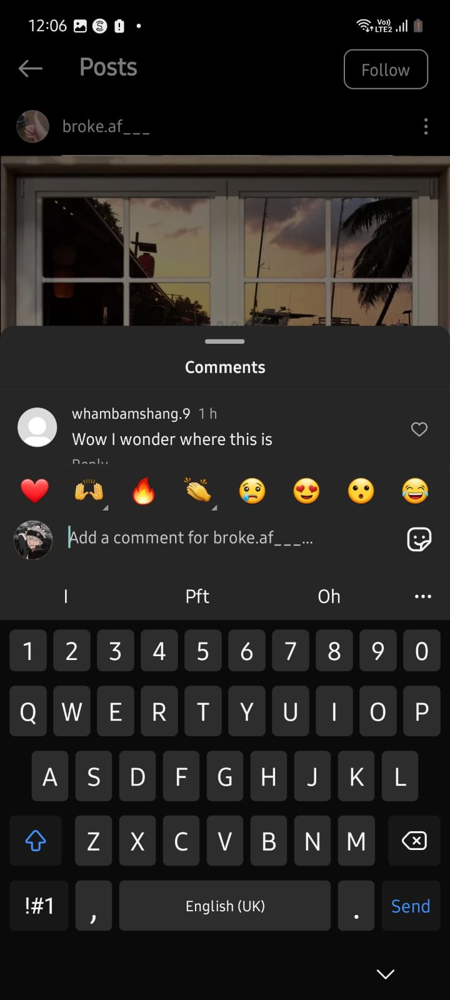
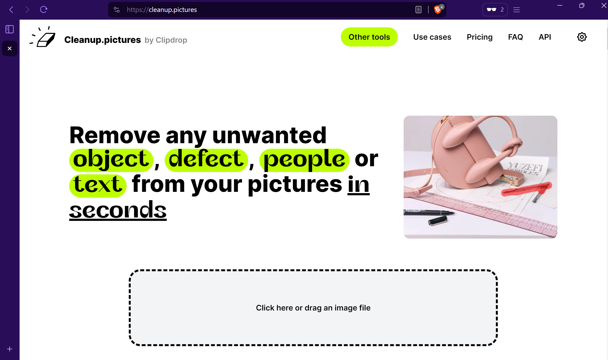

# NP YCEP24 - geotrouble

| Category | Difficulty |
| --- | --- |
| OSINT | Medium

## Challenge details
OHNOOOOOOOOOOOOO! A hacker from an organisation has infiltrated our base that goes by the username wham1257. Help me find the location of where he and his organisation might be!

Hint: The flag in is the format YCEP24{flag}. Flag should be replaced with the name of the place in google maps, no caps or spaces

## Challenge Solution
1. Search for the user wham1257 on instagram
2. Go to wham1257 tags and find a post

3. View the post's comments

4. Find another user's post

5. Use websites like cleanup.picture or any site to remove the windows (reverse image search will just show the window itself)

6. Reverse image search using google lens or any site

7. Go to google maps and find the exact name

### Flag
`Flag: YCEP24{ku-kaiizakaya}`
